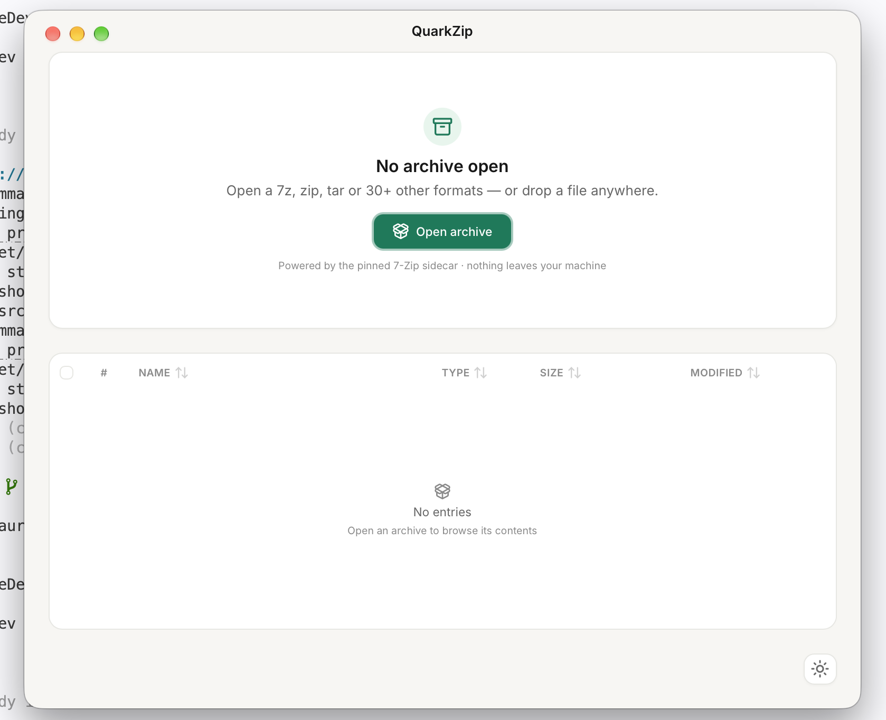
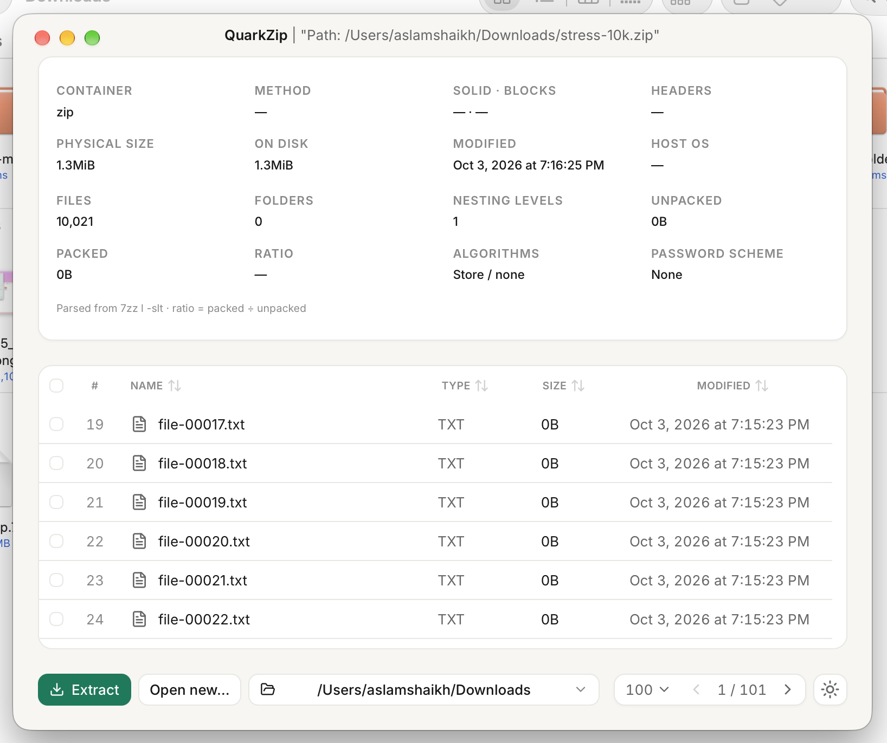
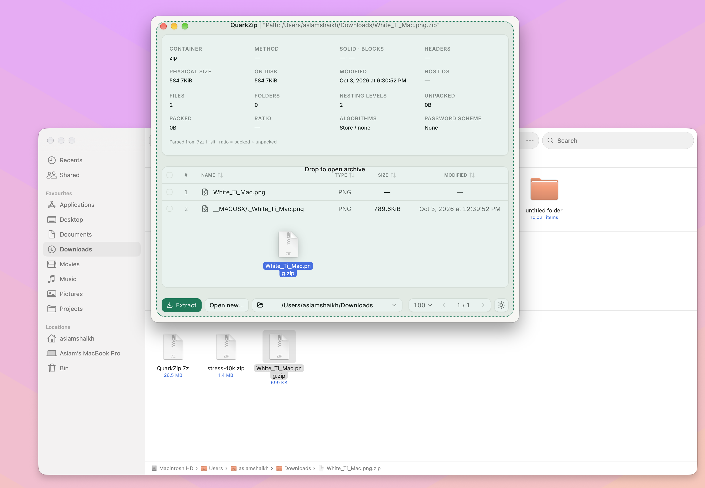

# QuarkZip

A visual 7-Zip archive manager for macOS (first), then Windows and Linux.
Tauri 2 + React + Tailwind v4 + Rust, shelling out to a pinned 7-Zip console binary.

## Screenshots





## Prereqs

- Node 20+, Rust stable, Xcode CLT (macOS)
- No pnpm needed — this project uses npm

## Quickstart

```sh
npm install
./scripts/fetch-7zz.sh   # downloads pinned 7-Zip 26.03 consoles, see docs/7zz-binaries.md
npm run tauri dev
```

Build per OS via GitHub Releases later:

```sh
npm run build
npm run tauri build
```

## Layout (per https://v2.tauri.app/start/project-structure/)

- `src/` — React + Tailwind v4 frontend (Vite)
- `src-tauri/` — Rust backend (`src/lib.rs` entry, `tauri.conf.json`, `capabilities/`)
- `src-tauri/binaries/` — 7zz sidecars (`externalBin: binaries/7zz`), fetched not committed
- `scripts/fetch-7zz.sh` — pinned 7-Zip fetch + normalize script
- `docs/7zz-binaries.md` — asset table, sidecar naming, license notes

## Status

Working archive manager (dev): open/list 10k-entry archives (virtualized,
paginated table + metadata grid), extract with confirm/result dialogs,
integrity test (`7zz t`) and MD5/SHA-1/SHA-256/SHA-512 checksums with
streaming progress (`docs/backend-commands.md`), About dialog, EN/HI runtime
translations with footer switcher (`docs/i18n.md`), light/system/dark themes,
per-OS window chrome (`docs/window-chrome.md`). Next: nested-archive temp
handling, in-archive add/rename/delete (see `docs/akizip-reference.md` §10).

## References

- [AkiZip](https://github.com/AkiZip/AkiZip) — visual 7-Zip archive manager for Linux (GTK4 + libadwaita, GPL-3.0). Feature and architecture reference for QuarkZip: format support, smart compression recommendations, in-archive management, background job queue with progress/ETA/cancel, logs panel.

## Contributing

See `CONTRIBUTING.md` — commits follow [Conventional Commits v1.0.0](https://www.conventionalcommits.org/en/v1.0.0/).


