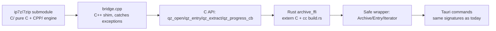

# 7-Zip reference (upstream)

Sources: **https://www.7-zip.org/download.html** · **https://en.wikipedia.org/wiki/7-Zip** (+ `/wiki/7z`) · **https://github.com/ip7z/7zip** (`main`), all fetched Oct 2026.

> Archiver by Igor Pavlov (since 1999). Current stable **26.04** (5 Oct 2026). Engine: portable C decoder/codecs (`C/`) + full COM-like C++ engine (`CPP/`), LGPL-2.1-or-later with unRAR restriction; LZMA SDK public domain.
> QuarkZip uses this as engine reference: format coverage target, sidecar pin tracking, and — the open question answered in §7 — in-process binding feasibility for our Rust backend.

## 0. Download page (7-zip.org/download.html, 26.04)

15 packages, all hosted on GitHub Releases (`.../releases/download/26.04/<name>`). Windows: `7z2604{-x64,, -arm64}.exe` installers (exe recommended over `.msi`: `7z2604{-x64,,}.msi`), `7z2604-extra.7z` (standalone console + 7z DLL + Far plugin), `7zr.exe`. Linux console: `7z2604-linux-{x64,x86,arm64,arm}.tar.xz`. macOS console: single `7z2604-mac.tar.xz` (arm64/x86-64). Source: `7z2604-src.{7z,tar.xz}` + `lzma2604.7z` (LZMA SDK: C, C++, C#, Java). 18 release assets total (extras: `7z2604-arm.exe` + auto source zips); page itself carries **no checksums** (per-asset `sha256:` lines live on GitHub Releases). Older blocks retained on-page back to 9.20 (2010). p7zip is declared legacy: "p7zip 16.02 is outdated… use new 7-Zip for Linux instead"; unofficial distro ports listed (Debian, Fedora, Gentoo, AltLinux, FreeBSD, keka, Amiga, Solaris, AIX).

## 1. Repo tree + build (`ip7z/7zip@main`, 1351 entries, Make-only)

```
7zip/
├── README.md (64 B) / Asm/{arm,arm64,x86}/ (CRC/SHA/AES/LZMA opts)
├── C/ (~128 + Util/ 57)     # portable C: 7z decoder (7zDec/7zArc), LZMA(2), PPMd,
│                            # BZip2, XZ, ZstdDec, SHA, AES, Threads + var_mac_arm64/x64.mak
│   └── Util/7z/7zMain.c     # ANSI-C demo client (7zDec e|l|t)
├── CPP/ (1136)
│   ├── 7zip/ (971)          # Archive/ (237, ~40 handlers) / UI/ (395: Console, FileManager,
│   │                         # GUI, Explorer, Far, Agent, Client7z, Common) / Compress/ (104)
│   │                         # / Crypto/ (30) / Common/ (51) / Bundles/ (104)
│   ├── Common/ (72)         # MyString/MyVector/MyCom/MyUnknown, UTFConvert, Wildcard, CRC…
│   └── Windows/ (91)        # Win32 shims (FileDir/FileIO/PropVariant/Sync…) + Control/
└── DOC/ (12)                # License.txt, copying.txt (LGPL-2.1 full), unRarLicense.txt,
                             # readme.txt, src-history.txt, 7zC.txt, 7zFormat.txt, Methods.txt
```

No `.github/`, no CMake, no root license file. POSIX builds are GNU-make only: `cd CPP/7zip/Bundles/Alone2 && make -j -f ../../cmpl_mac_arm64.mak` → `b/m_arm64/7zz` (clang, `USE_ASM=1`; x64 mirror via `cmpl_mac_x64.mak`). `Alone2` = full-format `7zz`; `Alone` = `7za` (7z/xz/cab/zip/gzip/bzip2/tar); `Alone7z` = `7zr` (7z-only). `DISABLE_RAR=1` / `DISABLE_RAR_COMPRESS=1` documented.

## 2. Embedding API (no stable public C API for the full engine)

Interfaces are internal COM-like (`CMyComPtr`, `CMyUnknownImp`, GUIDs in `CPP/7zip/Guid.txt`). Key headers: `CPP/7zip/IStream.h` (Read/Write/Seek), `ICoder.h` (Code, SetCoderProperties, Crypto, Hashers), `Archive/IArchive.h` (`IInArchive::{Open, GetNumberOfItems, GetProperty(kpidPath/Size/Attrib/MTime…), Extract}`, `IOutArchive::UpdateItems`, open/extract/update callbacks), `IProgress.h`, `IPassword.h`, `PropID.h`. C wrappers (limited): `C/7z.h` (`SzArEx_Init/Open/Free`, `SzArEx_Extract`, solid-block cache; flow documented in `DOC/7zC.txt`) and `C/LzmaLib.h` (both public domain). Client example: `CPP/7zip/UI/Client7z/` (loads `7z.so`, `CreateObject`, implements the three callbacks). Console itself lives in `CPP/7zip/UI/Console/`.

## 3. Formats, limits, technical claims

Write: 7z, ZIP, gzip, bzip2, xz, tar, WIM. Read-only: APM, ar, ARJ, chm, cpio, deb, FLV, JAR, LHA/LZH, LZMA, MSLZ, Office OOXML, onepkg, **RAR incl. RAR5 (decompress only — licence forbids a compressor)**, RPM, SMZIP, SWF, XAR, Z + cramfs/DMG/FAT/HFS/ISO/MBR/NTFS/SquashFS/UDF/VHD + ZIPX + some MSI/CAB/NSIS/SFX. zstd: unpack-only since v24.00 (not in Wikipedia text; XXH64 included). Codecs: LZMA (dict to ~4 GB), LZMA2, PPMd, BZip2, DEFLATE (own encoder, often beats zlib on size), BCJ/BCJ2 + ARM/PPC/IA-64/SPARC/Delta/Swap filters; solid archives; AES-256 (+ header encryption in 7z; ZIP AES has no name encryption; 2^19 SHA-256 key stretching). Multithreaded throughout. Ratios (data-dependent, vendor claim): 7z 30–70% over zip, zip 2–10% over rivals. Limits: 7z max 2^64 (~16 EiB); multi-volumes `xxx.7z.001…`; 7z stores no permissions/ACLs and no recovery records (tar-before-7z on Unix); broken multi-segment sets can't partially extract.

## 4. History, reception, security, variants

1999-01-02 first release (Pavlov); 7z format 2001; LZMA SDK public domain 2008-12-02; RAR5 extraction since v15.06 (2015); native Linux since 21.01-alpha (2021); repo `ip7z/7zip`. Recent: 26.00 (Feb 2026), 26.01 (Apr: huge-pages, `-spo` switch, 8 CVEs), 26.02 (Jun: CVE-2026-14266 XZ heap overflow), 26.03 (Sep: Joliet/compound, CVE-2026-58052 Mark-of-the-Web), **26.04 (5 Oct 2026: bug + vulnerability fixes)**. Older CVEs: DLL hijack (pre-16.03), ACE in RAR (CVE-2018-10115), ACE integer underflow (CVE-2023-31102), RCE (CVE-2024-11477), ACE CVSS 8.8 (CVE-2026-48095). Adoption: 428M SourceForge downloads 2002–2024; awards 2007–2013. Variants: p7zip (2016-stale POSIX port, superseded), 7-Zip ZS/mcmilk (Brotli/Fast-LZMA2/Lizard/LZ4/LZ5/Zstd in-7z + hashes/ciphers, tracks upstream), NanaZip (modern Windows fork: MSIX, dark mode, Smart Extraction, MotW propagation, hardening; tracks upstream). No published large-archive performance numbers beyond 64-bit large-memory-maps + multithreading.

## 5. Licensing (repo `DOC/`, Wikipedia concurs)

`DOC/License.txt` mapping: `CPP/7zip/Compress/Rar*` = **LGPL + unRAR restriction**; Lzfse/Zstd/Xxh = BSD; some files public domain; **everything else LGPL** (`DOC/copying.txt` = LGPL-2.1 full text). unRAR core term: sources may handle RAR archives freely but **cannot be used to re-create the RAR compression algorithm** (modified sources must carry the notice). Wikipedia infobox: `LGPL-2.1-or-later with unRAR restriction; LZMA SDK public domain`. Compatibility with QuarkZip (LGPL-3.0): the **-or-later** clause permits use under LGPL-3.0 terms — compliant provided we keep notices, ship the `DOC/` licence texts, keep vendored-source provenance (submodule, like MacPacker), and never write a RAR compressor (we won't; RAR stays read-only as today).

## 6. Binding 7-Zip into our Rust backend (MacPacker-style) — feasible, phased

Yes: Rust↔C is first-class (`extern "C"` + `cc` crate in `src-tauri/build.rs`), and the proven pattern is MacPacker's own — a small C++ shim exposing a C API over the COM-like engine, consumed cross-language:



Slice it by payoff: `C/` (pure C99, builds with our clang/gcc today, public-domain LZMA parts) is the easy FFI target but covers 7z decode/codecs only — not zip/rar/tar listing. Full multi-format needs the CPP bridge (the MacPacker-scale piece: ~250 sources + manifest + `sz_*`-style C surface), with `bindgen`/`cxx` as tooling options.

What it buys (our measurements): kills the 3 GB stdout round-trip (25 s emit + 48 s debug parse), in-process enumeration at ~MacPacker speed, per-entry progress callbacks, no Gatekeeper sidecar saga, no timeout architecture, one binary. Costs: bridge engineering + `unsafe` audit surface (C++ exceptions must never cross FFI), re-porting each 7-Zip release (they ship CVEs steadily — vendoring means _we_ patch; today we swap a binary), +MBs binary, in-process crashes take the app down (sidecar crashes are isolated), static-LGPL relinking duties (trivially satisfied: we ship source + submodule already).

Recommended phasing — **P0 now**: keep the sidecar (timeout/message fixes already in). **P1 prototype**: bridge list-only end-to-end for all formats behind a Rust trait mirroring today's `archive.rs` pure functions; sidecar stays as fallback while proving build/FFI/safety on all three targets (note: Windows builds need MSVC or clang story verified early). **P2**: cut the list path over (the measured win), keep sidecar for extract/test. **P3**: migrate extract/test, drop the sidecar. Alternative lane (evaluate, don't assume): pure-Rust crates for 7z/zip handling — far smaller unsafe surface, but verify handler coverage (40 formats) and solid-block/multi-volume behavior against our fixtures first. Also independent: bump the sidecar pin 26.03 → **26.04** (5 Oct 2026, bug + vulnerability fixes).
