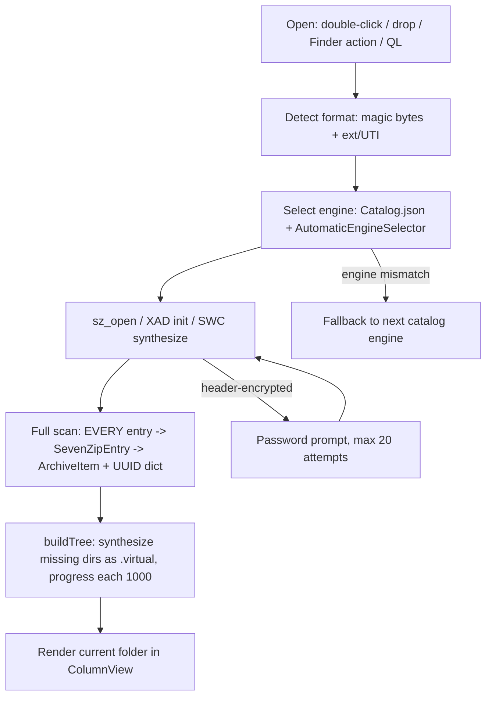
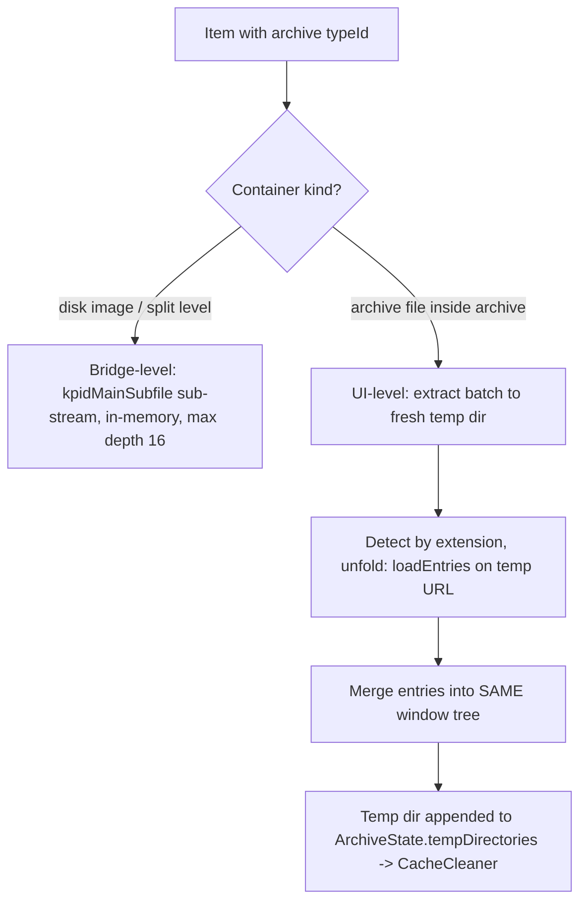
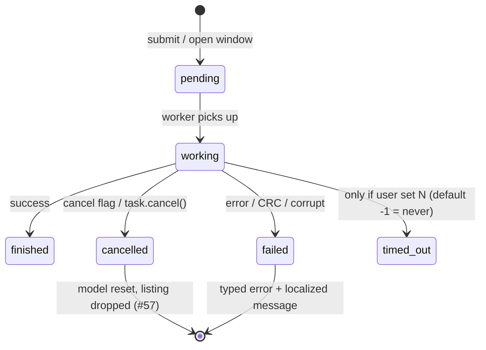
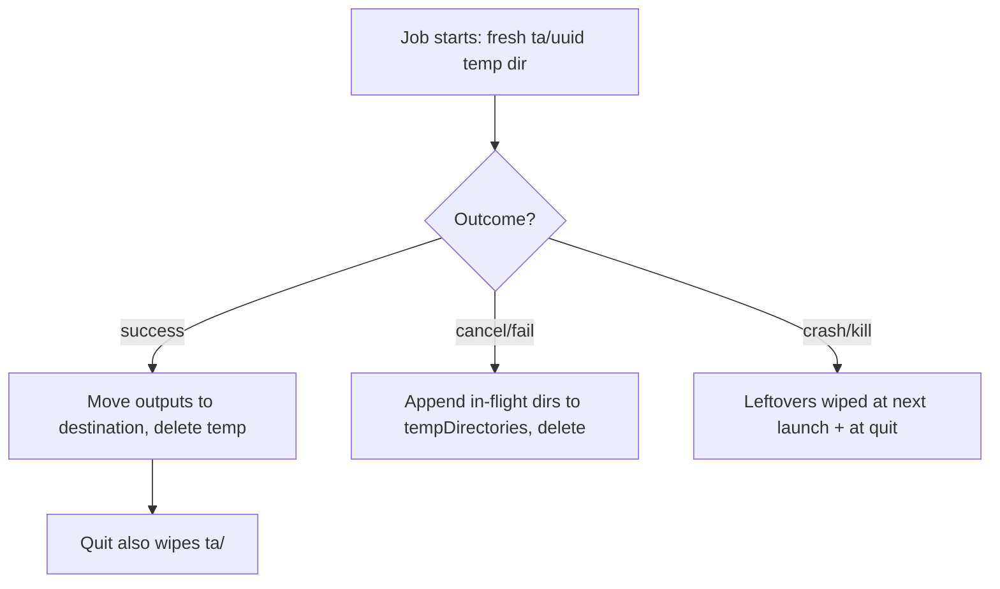

# MacPacker reference (upstream)

Upstream repo: **https://github.com/sarensw/MacPacker** (`main`, app version `v1.0.0`, Oct 2026).

> Archive manager and 7-Zip replacement for macOS. Swift + SwiftUI/AppKit, GPL-3.0, macOS 14.6+, Apple Silicon + Intel.
> Engine: **in-process libraries, no sidecar binaries** — vendored 7-Zip C/C++ sources compiled in-target, plus XADMaster and SWCompression, selected per format.
> Source verified from upstream `README.md`, `MacPacker.xcodeproj`, `Modules/Package.swift` + `Package.resolved`, `Modules/Sources/{Core,CSevenZip,Swift7zip,ArchivePreviewUI,FinderMenu}`, `MacPacker/Features/*`, `FinderExtension/`, `QuickLookExtension/`, `Config/`, `.github/workflows/`, `macpacker.app/en` (+ `/docs`, `/compare`, `/compare/keka`, `/compare/the-unarchiver`, `/compare/betterzip`, `/compare/7-zip`), and GitHub Releases + open issues (Oct 2026).
> QuarkZip uses this as feature/architecture reference: nested-archive browsing, selective extraction, engine fallback routing, progress/ETA/cancel wiring, sandbox temp lifecycle, and — equally — what _not_ to copy (main-thread I/O, unbounded full-listing loads, no open-path progress).

## 0. File hierarchy (accurate, `main` root, ~361 entries)

```
MacPacker/
├── README.md / CONTRIBUTING.md / AI_CONTRIBUTING.md / AGENTS.md
├── PRIVACY.md / TERMS.md
├── MacPacker.xcodeproj/            # Xcode shell; app SPM pins in
│   └── project.xcworkspace/xcshareddata/swiftpm/Package.resolved
├── Config/                         # build config, release infra source of truth
│   ├── Debug/Release/Release_Store.xcconfig + SigningOverride.xcconfig.template
│   ├── Version.xcconfig            # MARKETING_VERSION = 0.0.0-dev (CI stamps real version at tag)
│   ├── appcast.xml                 # Sparkle feed (Direct flavor only)
│   └── products/macpacker.json     # product definition + 16-locale changelog
├── MacPacker/                      # main app shell (SwiftUI entry + AppKit windows)
│   ├── MacPackerApp.swift / AppDelegate.swift / AppState.swift
│   ├── Core/                       # sandbox FolderAccessStore, UrlHandling (app.macpacker://), RecentArchives
│   ├── Features/                   # ArchiveContentViewer, ArchiveWindow, DropWindow,
│   │                               # ExtractionProgress, Settings, Welcome, PasswordWindow,
│   │                               # Updates/CheckForUpdatesView, …
│   ├── Assets.xcassets / AppIcon.icon
│   ├── Info.plist / Info_Store.plist / MacPacker.entitlements
│   └── Localizable.xcstrings / LeanBytes.xcstrings
├── FinderExtension/                # FinderSync ext (FinderSync.swift; deliberately Core-free)
├── QuickLookExtension/             # QL preview ext (PreviewViewController.swift)
├── Modules/                        # ALL app logic as local SPM package (swift-tools 6.2)
│   ├── Package.swift / Package.resolved
│   ├── Sources/Core/               # engines, Formats/Catalog.json, sandbox, settings, saver, extractor
│   │   ├── Engine/                 # Archive7ZipEngine, ArchiveXadEngine, ArchiveSwcEngine (actors),
│   │   │                           # ArchiveEngineSelector, ArchiveBatchResolver, BlockingWork, …
│   │   ├── Extraction/             # ExtractionProgressCenter, EngineProgressSupport, ProgressThrottle
│   │   ├── Formats/Catalog.json    # per-format engine routing + capabilities
│   │   └── Models/                 # ArchiveItem, ArchiveState, ArchiveLoader, ArchiveSaver, …
│   ├── Sources/CSevenZip/          # C/C++ bridge + vendor/7zip git submodule + SOURCES.md manifest
│   ├── Sources/Swift7zip/          # Swift wrapper over the C bridge (incl. SevenZipWriter)
│   ├── Sources/ArchivePreviewUI/   # shared Quick Look + in-app preview UI
│   ├── Sources/FinderMenu/         # dependency-free menu model shared app↔extension
│   └── Tests/CoreTests/            # + TestArchives git submodule (external 7zz as test oracle)
├── MacPackerUITests/ / MacPacker.xctestplan
├── scripts/check-architectures.sh  # universal-binary guard (post-build hook)
├── .ci/install-sevenzip.sh         # brew install sevenzip — TEST ORACLE ONLY, never shipped
├── .github/workflows/              # thin shells → LeanBytes/workflows-macos@v0.5.9
└── assets/
```

Submodules: `Modules/Sources/CSevenZip/vendor/7zip → ip7z/7zip` (pristine; fixes go in the bridge),
`Modules/Tests/CoreTests/TestArchives → sarensw/MacPacker-TestArchives`.

## 1. Tech stack

| Layer        | Choice                                                                                             | Notes                                                                                                                                                                                                                                                                          |
| ------------ | -------------------------------------------------------------------------------------------------- | ------------------------------------------------------------------------------------------------------------------------------------------------------------------------------------------------------------------------------------------------------------------------------ |
| Language     | Swift 5.0 (`SWIFT_VERSION`), swift-tools 6.2, `.swiftLanguageMode(.v6)` on newer modules           | Engines are Swift 6 `actor`s; `Sendable` throughout                                                                                                                                                                                                                            |
| UI           | SwiftUI app entry + AppKit windows                                                                 | `MacPackerApp: App` + `AppDelegate: NSApplicationDelegate`; `NSTableView` via representable, `NSWindowController`s (`ArchiveWindowManager`, `DropWindowController`, `ExtractionProgressWindowController`, `WelcomeWindowController`), `FIFinderSync`, `QLPreviewingController` |
| Platform     | macOS 14.6+ (`MACOSX_DEPLOYMENT_TARGET = 14.6`; v13 supported through v0.14.1)                     | Universal arm64 + x86_64, enforced by `check-architectures.sh`                                                                                                                                                                                                                 |
| Engine model | In-process libraries, **zero sidecar binaries**                                                    | No `7zz`/`unar`/`lsar`/libarchive argv anywhere; `7zz` exists only in `.ci/` as an external test oracle                                                                                                                                                                        |
| Concurrency  | Swift Tasks + actors; blocking C calls via `runBlocking` on `DispatchQueue.global(.userInitiated)` | Explicitly _not_ the cooperative pool ("does not replace threads that block"); no `OperationQueue`/`TaskGroup`/max-concurrency anywhere                                                                                                                                        |
| Persistence  | Sandbox bookmarks, app settings store, Sparkle appcast                                             | App Group `group.app.macpacker` shared app↔extensions                                                                                                                                                                                                                          |

## 2. Dependencies (SPM)

`Modules/Package.swift` (platforms `[.macOS(.v14)]`):

| Package                                                      | Version (pinned)                                   | Used for                                                          |
| ------------------------------------------------------------ | -------------------------------------------------- | ----------------------------------------------------------------- |
| `swiftlang/swift-subprocess`                                 | 0.4.0 (Modules) / 0.5.0 (app shell)                | Utility dep — **not** an archive engine (no extractor argv found) |
| `kumamotone/XADMasterSwift` (fork: `sarensw/XADMasterSwift`) | branch `main` (@d9dce63)                           | XAD engine: RAR/long-tail formats                                 |
| `tsolomko/SWCompression` + `BitByteData`                     | 4.8.6/2.0.4 (Modules) · 4.9.1/2.1.0 (shell)        | Single-stream formats (gz/bz2/lz4/xz), one pseudo-item per file   |
| `tailbeat/TailBeatKit` (`tb`)                                | 0.13.0 / 0.14.0                                    | Logging/telemetry kit                                             |
| `LeanBytes/SandboxPilotKit`                                  | 1.4.1 (app shell, DEBUG-only)                      | Sandbox helper for development                                    |
| Sparkle                                                      | 2.10.0 (Direct flavor only; compiled out of Store) | Auto-updates via `Config/appcast.xml`                             |

Engines (all in-process, selected per format by `Core/Formats/Catalog.json` + magic bytes, with automatic fallback + per-window pinning via `ArchiveEngineSelector`):

| Engine                                                                | Source                                                                                          | Invocation                                                                                                                                                       |
| --------------------------------------------------------------------- | ----------------------------------------------------------------------------------------------- | ---------------------------------------------------------------------------------------------------------------------------------------------------------------- |
| 7-Zip (`Archive7ZipEngine` → `Swift7zip` → `sevenzip_bridge.{cpp,h}`) | Vendored `ip7z/7zip` C/C++ (~250 files, `SOURCES.md` manifest; `_7ZIP_ST`, `Z7_NO_LARGE_PAGES`) | C API: `sz_open(path, password, …)` / `sz_get_entry` / `sz_extract_entries` / write via `sevenzip_bridge_write.cpp`. No argv. Default engine.                    |
| XAD (`ArchiveXadEngine`)                                              | `sarensw/XADMasterSwift` fork                                                                   | Library API `XADArchive` + private delegate (password + progress/cancel in one delegate). Header-encrypted 7z/RAR is an XAD limitation → auto-fallback to 7-Zip. |
| SWC (`ArchiveSwcEngine`)                                              | SWCompression + BitByteData                                                                     | Library API (e.g. decompress in `runBlocking`); memory-mapped input (`Data(…, .mappedIfSafe)`).                                                                  |

## 3. Format catalog (41 claimed; exactly 1 writable)

Detection by magic bytes (e.g. `37 7A BC AF 27 1C` @0 for 7z) plus extension/UTI.

| Category          | Formats (all extract-only **except ZIP**)                                                                                                         |
| ----------------- | ------------------------------------------------------------------------------------------------------------------------------------------------- |
| Archives (22)     | 7z, ar, arj, cab, chm, cpio, deb, exe (NSIS/SFX), lha, lzh, lzx, msi, pkg, rar (RAR5/.cbr/.r00), rpm, sea, sit, sitx, tar, xar (+.xip), zip, zipx |
| Disk images (11)  | dmg/.smi, fat/.img, iso, ntfs/.img, qcow2, squashfs/.sfs, vdi, vhd/vhdx, vmdk, wim/.swm/.esd                                                      |
| Single-stream (5) | bz2, gz, lz4, xz, z (+ tar.Z)                                                                                                                     |
| Tarballs          | tar.gz/.tgz, tar.bz2/.tbz2, tar.xz/.txz, tar.lz4/.tlz4, tar.Z/.taz                                                                                |

**Write = ZIP only**: create from scratch, add/delete/replace + save, Finder compress-to-ZIP, password encrypt (AES-256/ZipCrypto) + split volumes (both new in v1.0.0). Compound inputs (`tar.gz`) are staged first (inner extracted to temp, then loaded). Split sets resolve to the first volume in place. **Gaps**: no 7z/RAR/tar.gz creation, no non-ZIP edit, no convert, no CLI, no checksums/integrity UI (roadmap "coming next"), RAR/7z split-open partial.

## 4. End-to-end flows

### 4.1 Open / list



Listing is a **synchronous full scan with no streaming, pagination, sampling, or caps**: N `SevenZipEntry` + N `ArchiveItem` + a `[UUID:ArchiveItem]` dict materialize up front on a `runBlocking` thread; folder navigation re-iterates the whole list and re-sorts folders-first every time. `sz_get_entry` silently drops AppleDouble/`__MACOSX`/ADS entries. Only mitigation is the folder model itself — a flat 1M-file root is 1M objects in one store.

### 4.2 Nested archives (two mechanisms)



Marketing ("no intermediate extractions") holds only for bridge-level containers; file-in-file drill **does** extract to `~/Library/Caches/ta/<uuid>`.

### 4.3 Selective extract / drag-out / full extract

`ArchiveBatchResolver.resolveBatches`: expand folders to descendants → group by containing archive+engine → `[ResolvedBatch]`. `ArchiveExtractor.extract`: fresh temp dir → **one C pass over sorted indices** (`sz_extract_entries`) → `moveItem` top-level selections to destination (descendants ride along). Full archive uses `sz_extract_all` straight to destination. Drag-out is the same single-item temp flow + move to the promised URL. Multi-batch restarts engine counters (progress falls back to directory sampling).

macOS fidelity on extract: `chmod(mode & 07777)`, symlink recreation (`unlink` + `symlink`), mtime via `utimensat(AT_SYMLINK_NOFOLLOW)`, AppleDouble fold-back with `copyfile(UNPACK|XATTR|ACL)` preserving pre-existing xattrs — **but quarantine is actively refused** (`hadQuarantine` check + `removexattr`) so archives can't bless files. Failed entries are `unlink`ed (no empty husks). 7z-AES wrong password (no verifier) is inferred from CRC/data errors on encrypted entries.

### 4.4 Create / edit / save (ZIP the real path)

Diff model `ArchiveUpdateItem` (remove/move/addFile/addData/addDirectory) → `resolveDiff` (sidecars follow targets) → `ArchiveSaver` actor → `SevenZipArchive.writeArchive` off-pool. **In-place Save = temp file + atomic `replaceItemAt`**; refuses split-in-place, split-over-own-file, and stale `FileStamp` (mtime+size changed since open). Save-As extracts kept entries to scratch and rebuilds (progress = extract-half + write-half). Split volumes via `COutVolumeStream` (`base.001…`, refuses clobbering `name.[0-9]{3,}`). Encryption: AES-256/ZipCrypto, 7z-only name encryption, ASCII ≤99-char ZIP password rule. `.DS_Store` add-filtered (`excludingDSStore`); packed sidecars live in `__MACOSX/dir/._name` so signed `.app`s don't break. Directory dates: only created dirs get stamped, last.

### 4.5 Password attempts

`ArchivePasswordAttempts`: max 20 attempts per archive, then "password may be wrong, or the archive may be damaged" (neither 7z AES nor most XAD formats store a verifier). Per-URL cache; attempt>1 evicts stale entry (fixes a "stuck at 0%, 100% CPU" spin); cancel → `passwordCancelled`. Entry-encrypted 7z lists names, then extract loops retry with `setPassword`. XAD: delegate **must install at init** (folding happens during parse); header-encrypted gets exactly **one** try; entry-encrypted reopens per password with `passwordSuspectErrors` + `hasEncryptedEntry` gate, addressing entries **by path** (renumbering shifts indices after reopen).

### 4.6 Cancel / timeout lifecycle



Cancel is **cooperative via the progress callback**: `ProgressHandler(completed,total)->Bool` → `false` → `E_ABORT` → `SevenZipError.cancelled` → `CancellationError()`. Same shape on write and XAD (`archiveExtractionShouldStop`). Wiring: `ExtractionCancelFlag` (NSLock) → `ExtractionProgressCenter.requestCancel` → `{ cancelFlag.cancel(); task.cancel() }`; `Task.checkCancellation()` covers batch gaps. Open-path cancel = Swift-task cancel + generation guard (engines' `cancel()` is an empty stub — no mid-C-call abort on load). **No timeouts anywhere** in engine/bridge/Swift; the only timeout is the user-set preference (default -1).

## 5. Parallelism model

One `ArchiveState` (`@MainActor`) per window; all three engines are `final actor`s; **a new engine instance + one `SevenZipArchive` handle per open/job**. Overlapping opens serialize by generation counter + `openTask?.cancel()`. Extractions are independent `Task`s per job, each with its own cancel flag + temp dir. **Nothing caps simultaneous windows/jobs** — no queue, no `maxConcurrent`.

## 6. Progress + ETA

Source is 7-Zip's own `IProgress::SetTotal/SetCompleted` byte counters (in-process, never `-bsp`): bridge → `ProgressHandler` → `bridgeProgress` → `ArchiveExtractionProgress` → throttled `makeEngineProgress` → `ExtractionProgressCenter.reportEngineProgress`. Throttle: `ProgressThrottle(0.2s)` → main-async → center. Job keeps `engineTotalBytes`, `fractionCompleted`, `speedSamples` (cap 420, EMA α≈2/11), `estimatedSecondsRemaining = (total-completed)/speed`. XAD selective synthesizes global counters over the listing total; SWC reports nothing → indeterminate bar. Job stores supersede listing totals (`engineTotalBytes`).

## 7. Temp + disk + IO + cleanup

Locations: extraction/compound temp via `createTempDirectory()` → `~/Library/Caches/ta/<uuid>`; save path: system-temp `<uuid>.<ext>`; `scratch/<uuid>` for AppleDouble packing + Save-As rebuild. Lifecycle: `ArchiveState.tempDirectories` → `reset()/clean()` → `CacheCleaner`; **`applicationDidFinishLaunching` AND `applicationWillTerminate` wipe the whole `ta/`** (covers crash/kill leftovers at next launch); cancel/fail paths append in-flight temp dirs before finishing. Partial output: bridge `unlink`s undecodable entries; XAD deletes truncated files only if `isContained(resultUrl, in: destination)` (zip-slip guard on the delete itself). Save-As volume failure removes all volumes. **No disk-space preflight anywhere** (no capacity checks in engine/writer/saver/extractor).



IO: 7-Zip bridge streams per-entry (`COutFileStream::Create_ALWAYS`, no Swift-side chunk constants); SWC memory-maps (`mappedIfSafe`); `.ci` chunked copy (1 MiB) exists only for cross-device move fallback. Verification = per-entry `SetOperationResult` (CRC/data/unexpected-end/headers errors), no separate hash pass. `.DS_Store` excluded on add (exact filename match; pre-existing entries untouched). Write side excludes quarantine, provenance, macl, TextEncoding and lastuseddate from packed sidecars (which live in `__MACOSX/dir/._name`); extraction folds sidecars back, refuses quarantine, removes emptied `__MACOSX` dirs, and stamps only created dirs, last.

## 8. UI, Finder, Quick Look, prefs

Main window is a Finder-like browser (names + sizes, breadcrumbs, sortable columns, Finder keys, Back button since v0.21.0). Welcome launcher on cold start (simplified v1.0.0). Compress window (new v0.21.0; v1.0.0 adds encryption, split volumes, level, `.DS_Store` exclusion). Settings: recent-archives on/off, one-time folder-access grant, Advanced clear-cache, Finder-integration options. No theme switch (#102). Progress window for extract/drag-out; compress shows no progress (#192 open). MRU recent-archives list (disableable).

FinderSync extension builds its menu from dependency-free `FinderMenu` (open / extractHere / extractToFolder / extractToChosenFolder / addToArchive / compressToZip / compressToDatedZip / compressTo7z / compressEachSeparately / compressFolderContents), talks to the app via `app.macpacker://` URL scheme + App Group, and deliberately does **not** link Core. Fragile contexts (open issues): external volumes (#275), iCloud Drive (#305), SMB (#284), "compress to zip does nothing" (#278), actions opening the launcher (#279).

QuickLook extension shares `ArchivePreviewUI`: spacebar preview incl. cbz/cbr (v1.0.0), follows engine settings, opens nested archives and asks passwords in-preview (beta trail). ~30 `QLSupportedContentTypes`.

## 9. Performance + large file/count handling

No published numbers anywhere (site, docs, README, releases). Engine is 7-Zip 26.03 (updated v0.22.0). Startup wipes `Caches/ta` **synchronously** (post-crash large cache delays first window, #301). Drag-out = extract to cache then move (same-volume rename is instant; cross-volume full copy **on the main thread**, progress frozen, #300). Compress has no progress UI (#192). Cancel resets the model and drops the listing (#57).

Large inputs: **no caps, sampling, pagination, or virtualized model** — full scan into N objects + UUID dict, full re-scan + re-sort per folder navigation. Tens-of-thousands-file archives and nested levels multiply cache cost. Temp-disk doubling (extract-to-cache-then-move) needs ~2× free space transiently. No entry-count/size warnings exist on any path.

## 10. Edge cases (changelog archaeology) + error paths

Recurring edge classes from releases: macOS metadata/xattrs (strip on create, fold-back on extract, damaged-app extraction, `.DS_Store` noise now opt-out), Unix permissions/symlinks (execute-bit/link strip fixed v1.0.0), split-volume naming (extension case, split suffix, `.z01` vs `.001`), Finder plumbing (toolbar icon size, launcher opening), window state (size/position memory v0.22.0). Data-loss class fixed: wrong-file delete (index mapping), double-open, replace-fails, `FileStamp` staleness refusal.

| Trigger            | Result                                                                                                 |
| ------------------ | ------------------------------------------------------------------------------------------------------ |
| Corrupt/truncated  | `describeOpResult` strings → `extractionFailed` / `openFailed("No suitable archive format found")`     |
| Unsupported format | Detector nil → `invalidArchive("…not a recognised archive type")`; auto-mode falls back to next engine |
| Wrong password     | 20-attempt loop; XAD header-encrypted single try; ends `invalidArchive` with engine-switch hint        |
| Disk full          | `writeFailed` / stream errors; **no preflight**                                                        |
| Permission denied  | Saver retries once after folder-access grant; split loads need upfront grant                           |
| Zip-slip           | Bridge strips `""`/`.`/`..`/absolute segs; XAD `isContained` gates cleanup deletes                     |

## 11. QuarkZip takeaways (adopt / avoid / divergent)

Adopt: cooperative cancel via progress callback returning abort (exactly our `LIST_CANCEL` + kill model, but finer-grained); atomic save (temp + replace); active quarantine refusal on extract; external-oracle QA tests; bridge-level nested drilling for disk images; ETA from byte counters with EMA + throttled UI updates; per-window engine pinning. Avoid: main-thread file I/O of any kind; unbounded full-listing materialization with per-navigation full rescans; no progress/cancel on the open path; silent temp-disk doubling without preflight; index-based entry addressing across reopens (use paths); model-resetting cancel that drops the loaded listing. Divergent by design: sidecar-subprocess engine (ours) vs in-process libraries (theirs) — ours pays IPC/parse costs per line but keeps 7-Zip upgrades to a binary swap and crashes isolated; theirs pays vendored-source maintenance + in-process memory. Our LoadDialog counters + cancel already exceed their open-path UX.

## 12. Appendix A — compare pages in full (`macpacker.app/en/compare*`, fetched Oct 2026)

Methodology (stated on every page): **Read** = list contents + extract. **Write** = produce the format (create, and where noted update). A format appears iff ≥1 compared app supports it. **Totals count table rows, where one row can stand for a format family — orientation only**, since every vendor counts differently. Compiled **10 August 2026** (MacPacker side: `0.19.0`).

### 12.1 The five apps (main `/compare`: 68 formats · 9 capabilities)

| App            | Version          | Price                 | Licence                 | Needs        | Shape                  | Read | Write |
| -------------- | ---------------- | --------------------- | ----------------------- | ------------ | ---------------------- | ---- | ----- |
| MacPacker      | 0.19.0           | Free                  | GPL-3.0, open source    | macOS 14.6+  | Archive browser        | 39   | 1     |
| 7-Zip          | 26.02 console    | Free                  | LGPL + BSD, open source | 64-bit macOS | Command line only      | 43   | 9     |
| The Unarchiver | 4.3.9 (Mar 2025) | Free                  | Proprietary (MacPaw)    | macOS 10.13+ | Extractor              | 42   | 0     |
| Keka           | 1.6.7 (Jun 2026) | Free; $6.49 App Store | Proprietary             | macOS 10.10+ | Compressor / extractor | 33   | 16    |
| BetterZip      | 6.0.4 (2026)     | $35 one-time          | Proprietary             | macOS 13.5+  | Archive manager        | 34   | 15    |

Per-pair pages (same data filtered to rows either app handles): vs Keka 49 formats, vs The Unarchiver 54, vs BetterZip 46, vs 7-Zip 49 — each 9 capabilities, footnotes renumbered per page.

### 12.2 Capability matrix (verbatim descriptions; Y = Yes, P = Partial, – = No)

| Capability                                                              | MacPacker | 7-Zip  | Unarchiver | Keka | BetterZip |
| ----------------------------------------------------------------------- | --------- | ------ | ---------- | ---- | --------- |
| Open split sets — joining .001/.z01/.r00 parts                          | P [11]    | Y      | Y          | Y    | Y         |
| Create split volumes — writing across sized parts                       | N         | Y      | N          | Y    | Y         |
| Open password-protected archives                                        | Y         | Y      | Y          | Y    | Y         |
| Write encrypted archives — AES-256 (MP save panel: format + level only) | N         | Y      | N          | Y    | Y         |
| Modify in place — add/delete/rename without full repack                 | P [12]    | Y      | N          | N    | Y         |
| Archive browser — list contents before extracting                       | Y         | P [13] | N          | N    | Y         |
| Browse nested archives — without extracting the outer first             | Y         | N      | N          | N    | N         |
| Finder / Quick Look extensions                                          | Y         | N      | N          | Y    | Y         |
| Command-line interface                                                  | N         | Y      | P [14]     | Y    | Y         |

Footnotes, verbatim (main-page numbering): [1] 7-Zip's ZIP handler registers `.zipx` and decodes WinZip LZMA/PPMd/BZip2 methods but doesn't advertise ZIPX output. [2] Supported in practice, not on the vendor's format page. [3] RAR writing needs the external `rar` tool (BetterZip can fetch it; licence bought separately). [4] Unarchiver reads ARJ but not multi-part sets. [5] Unarchiver reads only pre-2.0 ACE (no WinAce). [6] MacPacker detects by content, so any ZIP container opens whatever it's called. [7] `.xip` is XAR. [8] tar-then-compress is two passes, no single command. [9] Writing JAR/APK/IPA = writing a ZIP container (no signing/manifests anywhere). [10] Keka's AAR is Apple Archive; MacPacker's `.aar` is Android Archive (unrelated). [11] Split ZIP sets only (`.z01`, `.zip.001`); RAR/7z sets unrecognised. [12] ZIP only. [13] macOS 7-Zip is console-only: `7zz l` lists, no window. [14] `unar`/`lsar` are a separate download.

### 12.3 Format matrix, all 68 rows (cells are Read/Write; Y/P/–)

Everyday archives:

| Format                                               | MP  | 7-Zip | Unarchiver | Keka | BetterZip |
| ---------------------------------------------------- | --- | ----- | ---------- | ---- | --------- |
| ZIP (.zip .jar .war .apk .ipa .appx .xpi .epub .cbz) | Y/Y | Y/Y   | Y/–        | Y/Y  | Y/Y       |
| ZIPX (.zipx)                                         | Y/– | P/–   | Y/–        | Y/–  | Y/–       |
| 7z (.7z)                                             | Y/– | Y/Y   | Y/–        | Y/Y  | Y/Y       |
| RAR/RAR5 (.rar .cbr .r00)                            | Y/– | Y/–   | Y/–        | Y/–  | Y/P       |
| TAR (.tar)                                           | Y/– | Y/Y   | Y/–        | Y/Y  | Y/Y       |
| ARJ (.arj)                                           | Y/– | Y/–   | P/–        | –/–  | Y/–       |
| LHA/LZH                                              | Y/– | Y/–   | Y/–        | Y/–  | Y/–       |
| CAB (.cab)                                           | Y/– | Y/–   | Y/–        | Y/–  | Y/–       |
| CHM (.chm)                                           | Y/– | Y/–   | –/–        | –/–  | Y/–       |
| CPIO (.cpio .cpgz)                                   | Y/– | Y/–   | Y/–        | Y/–  | Y/–       |
| ACE (.ace)                                           | –/– | –/–   | P/–        | Y/–  | –/–       |
| ALZip (.alz)                                         | –/– | –/–   | Y/–        | –/–  | –/–       |
| ARC/PAK                                              | –/– | –/–   | Y/–        | –/–  | –/–       |
| Zoo (.zoo)                                           | –/– | –/–   | Y/–        | –/–  | –/–       |

Platform & package formats:

| Format                    | MP  | 7-Zip | Unarchiver | Keka | BetterZip |
| ------------------------- | --- | ----- | ---------- | ---- | --------- |
| AR (.ar .a .lib)          | Y/– | Y/–   | Y/–        | –/–  | –/–       |
| Debian (.deb)             | Y/– | Y/–   | Y/–        | –/–  | Y/–       |
| RPM (.rpm)                | Y/– | Y/–   | Y/–        | –/–  | Y/–       |
| XAR (.xar)                | Y/– | Y/–   | Y/–        | Y/–  | Y/Y       |
| Apple pkg (.pkg)          | Y/– | Y/–   | Y/–        | –/–  | Y/–       |
| Apple xip (.xip)          | Y/– | Y/–   | Y/–        | Y/–  | Y/–       |
| MSI/OLE                   | Y/– | Y/–   | Y/–        | Y/–  | –/–       |
| EXE/NSIS                  | Y/– | Y/–   | P/–        | Y/–  | P/–       |
| WIM (.wim .swm .esd)      | Y/– | Y/Y   | –/–        | Y/Y  | Y/–       |
| Apple Archive (.aar .yaa) | –/– | –/–   | –/–        | Y/Y  | –/–       |

Legacy, Mac-classic and long tail:

| Format                  | MP  | 7-Zip | Unarchiver | Keka | BetterZip |
| ----------------------- | --- | ----- | ---------- | ---- | --------- |
| StuffIt (.sit)          | Y/– | –/–   | Y/–        | –/–  | Y/–       |
| StuffIt X (.sitx)       | Y/– | –/–   | P/–        | –/–  | Y/–       |
| StuffIt SEA (.sea)      | Y/– | –/–   | Y/–        | –/–  | Y/–       |
| Compact Pro (.cpt)      | –/– | –/–   | Y/–        | Y/–  | –/–       |
| DiskDoubler/PackIt      | –/– | –/–   | Y/–        | –/–  | –/–       |
| BinHex/MacBinary        | –/– | –/–   | Y/–        | –/–  | Y/–       |
| LZX (.lzx)              | Y/– | –/–   | Y/–        | –/–  | –/–       |
| Amiga ADF/DMS           | –/– | –/–   | Y/–        | –/–  | –/–       |
| CP/M LBR                | –/– | –/–   | Y/–        | –/–  | –/–       |
| TNEF (winmail.dat)      | –/– | –/–   | –/–        | –/–  | Y/–       |
| WARC (.warc)            | –/– | –/–   | Y/–        | –/–  | –/–       |
| Game data (NDS/NSA/SAR) | –/– | –/–   | Y/–        | –/–  | –/–       |
| SWF media extraction    | –/– | Y/–   | Y/–        | –/–  | Y/–       |
| PDF image extraction    | –/– | –/–   | Y/–        | –/–  | Y/–       |

Single-stream compression:

| Format             | MP  | 7-Zip | Unarchiver | Keka | BetterZip |
| ------------------ | --- | ----- | ---------- | ---- | --------- |
| GZIP (.gz)         | Y/– | Y/Y   | Y/–        | Y/Y  | Y/Y       |
| BZIP2 (.bz2)       | Y/– | Y/Y   | Y/–        | Y/Y  | Y/Y       |
| XZ (.xz)           | Y/– | Y/Y   | Y/–        | Y/Y  | Y/Y       |
| LZMA raw (.lzma)   | –/– | Y/–   | Y/–        | Y/–  | –/–       |
| Unix compress (.Z) | Y/– | Y/–   | Y/–        | Y/–  | Y/Y       |
| LZ4 (.lz4)         | Y/– | –/–   | –/–        | Y/–  | –/–       |
| Zstandard (.zst)   | –/– | Y/–   | –/–        | Y/Y  | Y/Y       |
| Brotli (.br)       | –/– | –/–   | –/–        | Y/Y  | Y/Y       |
| lzip (.lz)         | –/– | –/–   | –/–        | Y/Y  | –/–       |
| lrzip (.lrz)       | –/– | –/–   | –/–        | Y/Y  | –/–       |
| LZO/Snappy         | –/– | –/–   | –/–        | Y/–  | –/–       |

Compound tar streams:

| Format                  | MP  | 7-Zip | Unarchiver | Keka | BetterZip |
| ----------------------- | --- | ----- | ---------- | ---- | --------- |
| tar.gz/bz2/xz/Z         | Y/– | Y/P   | Y/–        | Y/Y  | Y/Y       |
| tar.lz4 (.tlz4)         | Y/– | –/–   | –/–        | Y/–  | –/–       |
| tar.zst/br (.tzst .tbr) | –/– | P/P   | –/–        | Y/Y  | Y/Y       |

Disk images and filesystems:

| Format                    | MP  | 7-Zip | Unarchiver | Keka | BetterZip |
| ------------------------- | --- | ----- | ---------- | ---- | --------- |
| Apple DMG                 | Y/– | Y/–   | –/–        | Y/Y  | Y/Y       |
| ISO 9660                  | Y/– | Y/–   | Y/–        | Y/Y  | Y/Y       |
| Raw disc (.bin .mdf .nrg) | –/– | –/–   | Y/–        | –/–  | –/–       |
| UDF                       | –/– | Y/–   | –/–        | –/–  | –/–       |
| SquashFS                  | Y/– | Y/–   | –/–        | Y/–  | –/–       |
| FAT                       | Y/– | Y/–   | –/–        | –/–  | –/–       |
| NTFS                      | Y/– | Y/–   | –/–        | –/–  | –/–       |
| HFS/HFS+                  | –/– | Y/–   | –/–        | –/–  | –/–       |
| ext2/3/4                  | –/– | Y/–   | –/–        | –/–  | –/–       |
| APFS                      | –/– | Y/–   | –/–        | –/–  | –/–       |
| CramFS                    | –/– | Y/–   | –/–        | –/–  | –/–       |
| VirtualBox VDI            | Y/– | Y/–   | –/–        | –/–  | –/–       |
| Hyper-V VHD/VHDX          | Y/– | Y/–   | –/–        | –/–  | –/–       |
| VMware VMDK               | Y/– | Y/–   | –/–        | –/–  | –/–       |
| QEMU QCOW2                | Y/– | Y/–   | –/–        | –/–  | –/–       |
| MBR/GPT maps              | –/– | Y/–   | –/–        | –/–  | –/–       |

### 12.4 Staleness audit vs MacPacker v1.0.0 + reading for QuarkZip

Pages frozen at 0.19.0 (10 Aug 2026). Two capability rows changed since: **Create split volumes → Yes** and **Write encrypted archives → Yes** (AES-256/ZipCrypto + split volumes shipped in v1.0.0; the "save panel exposes format and compression level only" note is stale). Totals (39/1 vs 43/9 vs 42/0 vs 33/16 vs 34/15) are row counts, not extension counts.

For QuarkZip: our engine is the 7-Zip 26.03 sidecar, so our read coverage tracks the **7-Zip column** (43 rows — broadest on disk images/filesystems) while our UI reads like BetterZip/MacPacker (browser + nested drill + modify ambitions). Gaps the matrix exposes for us: no split-set joining yet, single-stream **write** is read-only in our UI, and no CLI.
...[truncated 6154 chars]
